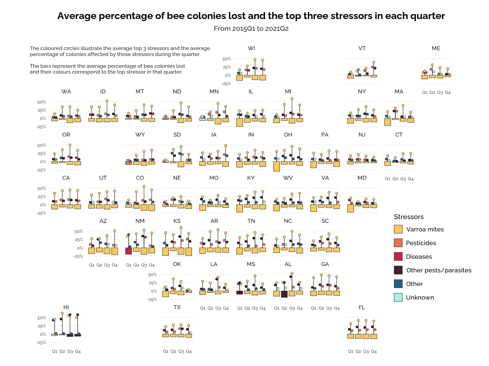

I don't know much about bees but I do know a lovely poem ["The Scientist and The Bumblebee"](https://youtu.be/dAI6XZYHMiY?t=141) by Harry Baker. It is about how scientists once proved that bumblebees should not be able to fly but they obviously can fly.

> So don't ever let someone tell you what you can't do,<br/> because just because it's proven, <br/> doesn't mean it's true

Here's a stanza that is vaguely relevant:

> They'd rather follow their charts <br/> than follow their hearts. <br/> If they saw a bee leave <br/> they'd still follow their graphs. <br/> They preferred facts and figures <br/> to beeswax and vigour, <br/> but she begged to differ <br/> as she flew past and laughed.

This tidytuesday presented an opportunity to use `{geofacet}` `r emo::ji('package')`. I have seen it often but this is my first time using it. I decided to visualise the average percentage of lost bee colonies and the top stressors in each quarter for each state.

Since I wanted the abbreviated name of the state (e.g. AZ instead of Arizona), I used `inner_join()` to combine the the cleaned data set with the `us_state_grid1` data which is part of `{geofacet}` `r emo::ji('package')`.

```{r setup, eval = FALSE, code_folding=TRUE}
# Load libraries and data -------------------------------------------------
library(tidyverse)
library(geofacet)
library(MetBrewer)
library(showtext)

colony <- readr::read_csv('https://raw.githubusercontent.com/rfordatascience/tidytuesday/master/data/2022/2022-01-11/colony.csv')
stressor <- readr::read_csv('https://raw.githubusercontent.com/rfordatascience/tidytuesday/master/data/2022/2022-01-11/stressor.csv')

# create grid that filters out missing states data
my_grid = us_state_grid1 %>% filter(name %in% colony$state)

# Cleaning data -----------------------------------------------------------
c <- colony %>% 
  filter(months != '2019') %>% 
  filter(!is.na(colony_lost_pct)) %>% 
  group_by(months, state) %>% 
  summarise(colony_lost_pct = mean(colony_lost_pct/100)) %>% 
  mutate(months = factor(months, labels = c('Q1','Q2','Q3','Q4'),
         levels = c('January-March','April-June','July-September','October-December'))) %>%
  inner_join(my_grid[3:4], by = c('state' = 'name')) 
  
s <- stressor %>% 
  filter(months != '2019') %>% 
  mutate(stressor = ifelse(stressor=='Disesases','Diseases',stressor)) %>% 
  group_by(months, state, stressor) %>% 
  summarise(stressor_avg = mean(stress_pct/100, na.rm = TRUE)) %>% 
  mutate(months = factor(months, labels = c('Q1','Q2','Q3','Q4'),
                         levels = c('January-March','April-June','July-September','October-December'))) %>%
  inner_join(my_grid[3:4], by = c('state' = 'name')) 
```

<aside>

I found that `{dplyr}` has join functions that work just like SQL joins. I love how intuitive SQL joins are.

</aside>

Next, I identified the top 3 stressors for each quarter and merged the datasets for plotting.

```{r clean data, eval = FALSE, code_folding=TRUE}
# identify on avg, the top 3 stressors for each quarter
s_top3 <- s %>% 
  group_by(months, state) %>% 
  slice_max(stressor_avg, n = 3) %>% 
  arrange(-stressor_avg, .by_group = TRUE) %>% 
  mutate(rank = seq(1,3))
s_top3$stressor <- factor(s_top3$stressor, levels = c('Varroa mites', 'Pesticides', 'Diseases',
                                                       'Other pests/parasites', 'Other', 'Unknown'))

# merge datasets for plotting
c_s <- merge(s_top3, c, by = c('months','state','code'), all = T)
c_s$stressor <-  factor(c_s$stressor, levels = c('Varroa mites', 'Pesticides', 'Diseases',
                                                 'Other pests/parasites', 'Other', 'Unknown'))
  
```

I placed the average percentage of bee colonies lost on the negative y axis since lost is negative and it seemed more intuitive. On the positive y axis, I illustrated the top 3 stressors for each quarter. It was difficult to do so without making the graph too cluttered. Ultimately, I used dodged `geom_point` and a single `geom_segment`. Although `geom_point` makes it a bit tougher to read the value of the exact point on the y axis, I figured that information was not of priority. The fill colour of the points that identify the stressors is more important. I wanted to keep the top stressor layered above the second and third stressors thus I separated them into three different geoms. To keep the graph neat, I opted for a single `geom_segment`. I really like the overall visual of the graph.

```{r graph, eval = FALSE, code_folding=TRUE}
palette <- (c('#FFC857','#E9724C','#C5283D','#481D24','#255F85','#B1EDE8'))

plot<-ggplot(c_s, aes(months, -colony_lost_pct)) +
  geom_col(aes(fill = stressor),color = '#1b2b34', size = 0.2, width = 0.8) +
  # split up each rank to ensure that the higher rank is layered above the lower rank (i.e. rank 1 above rank 2 & 3)
  geom_segment(data = s_top3, aes(x = months, xend = months,y = 0, yend = stressor_avg), 
               position = position_dodge(0.1), size = 0.2)+
  geom_point(data = s_top3 %>% filter(rank == 3), aes(x = months, y = stressor_avg, fill = stressor),
             shape = 21, size = 1.2, stroke = 0.2, colour = "#1b2b34", show.legend = FALSE,
             position = position_nudge(x = 0.18)) +
  geom_point(data = s_top3 %>% filter(rank == 2), aes(x = months, y = stressor_avg, fill = stressor),
             shape = 21, size = 1.2, stroke = 0.2, colour = "#1b2b34", show.legend = FALSE,
             position = position_nudge(x = -0.18)) +
  geom_point(data = s_top3 %>% filter(rank == 1), aes(x = months, y = stressor_avg, fill = stressor),
             shape = 21, size = 1.2, stroke = 0.2, colour = "#1b2b34", show.legend = FALSE) +
  
  # scales and facet
  scale_fill_manual(values = palette, drop = FALSE) +  # remove legend marking inside legend key! 
  guides(fill = guide_legend(byrow = TRUE)) +  # enables adjustment of spacing between legend items
  scale_y_continuous(labels = scales::percent) +
  facet_geo(facets = vars(code), grid = my_grid) +

  # theme
  coord_cartesian(clip = 'off') +
  theme_minimal() +
  theme(text=element_text(family='Raleway', size = rel(5)), 
        # facets
        panel.spacing.y = unit(-0.5, "lines"),  # reduce vertical spacing between facets 
        axis.ticks.x = element_blank(),
        panel.grid.major.y = element_line(size = .25, color = "#ececec"),
        panel.grid.minor.y = element_blank(),
        panel.grid.major.x = element_blank(),
        axis.title.y = element_text(margin = margin(t = 0, r = 20, b = 0, l = 0)),
        strip.text = element_text(size = rel(4), margin = margin(t=10,r = 0, b = 2, l = 0)),
        
        # title, subtitle, description
        plot.title = element_text(hjust = 0.5, size = rel(7), face = 'bold'),
        plot.subtitle = element_text(hjust = 0.5, size = rel(5), color = '#1b2b34'),
        plot.tag.position = c(0.04, 0.86),
        plot.tag = element_text(size = rel(3.8), color  = '#1b2b34', hjust = 0, lineheight = 0.3),
  
        # legend
        plot.margin=margin(c(0.5,1.5,0.5,0.5), unit="cm"),  # extends right margin so that legend will not be cut off
        legend.position = c(0.95, 0.3),
        legend.text = element_text(size = rel(4.5), margin = margin(l = -8, unit = 'pt')),
        legend.spacing.y = unit(0.4, 'lines'),  # only works if byrow = TRUE for guide_legend
        legend.key.size = unit(0.7, 'lines')  # size of the square legend keys
        ) + 
  
  labs(x = NULL, y = '',
       fill = 'Stressors',
       title = 'Average percentage of bee colonies lost and the top three stressors in each quarter',
       subtitle = 'From 2015Q1 to 2021Q2',
       tag = 'The coloured circles illustrate the average top 3 stressors and the average \npercentage of colonies affected by those stressors during the quarter.\n\nThe bars represent the average percentage of bee colonies lost\nand their colours correspond to the top stressor in that quarter.'
       ) 

ggsave("bee_colonies.png", plot, device = ragg::agg_png, width = 20, height = 15, units = "cm", res = 300)
```

## The final product

```{r img, echo=FALSE}

```

## Some `ggplot` takeaways

### Remove legend marking inside the legend key

```{r legend marking, eval = FALSE}
scale_fill_manual(values = palette, drop = FALSE) 
```

### Adjust vertical spacing between legend items

```{r legend spacing, eval = FALSE}
guides(fill = guide_legend(byrow = TRUE)) +  # enables adjustment of spacing between legend items
theme(legend.spacing.y = unit(0.4, 'lines'))  # only works if byrow = TRUE for guide_legend
```

### Placement of legends

In this graph, I wanted the legend inside the plot but near the edge. To do so, I specified the `legend.position`. Hence, Unfortunately, this causes the legend to be cut off. To mitigate that, I extended the right margin of the plot.

```{r legend placement, eval = FALSE}
theme(plot.margin=margin(c(0.5,1.5,0.5,0.5), unit="cm"), 
      legend.position = c(0.95, 0.3))
```

### Reduce vertical spacing between facets

Since there are a lot of facets, space was a huge constraint.

```{r facet spacing, eval = FALSE}
theme(panel.spacing.y = unit(-0.5, "lines")) 
```

### Additional text descriptions

I wanted to have some text explaining how to read the graph but I already have a subtitle. I found that `tag` can be used to add text anywhere in the plot.

```{r tag, eval = FALSE}
theme(plot.tag.position = c(0.04, 0.86),
      plot.tag = element_text(size = rel(3.8), color = '#1b2b34', hjust = 0, lineheight = 0.3)) +
labs(tag = 'The coloured circles illustrate ...')
```
